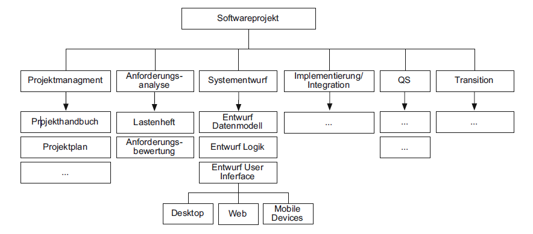
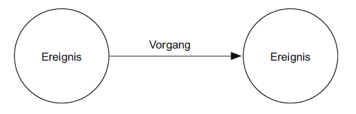
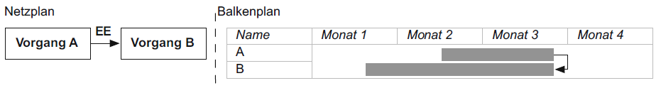
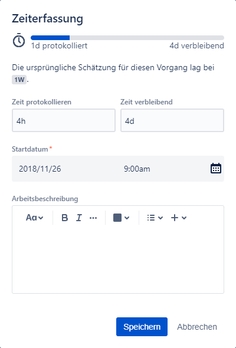
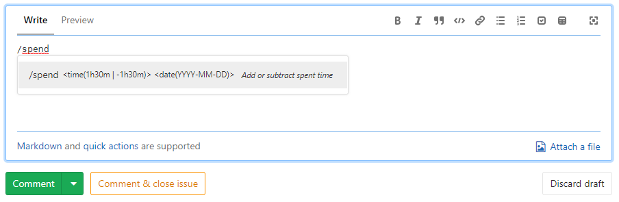
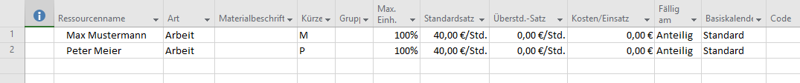
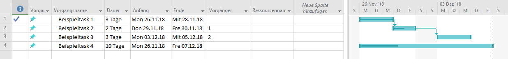
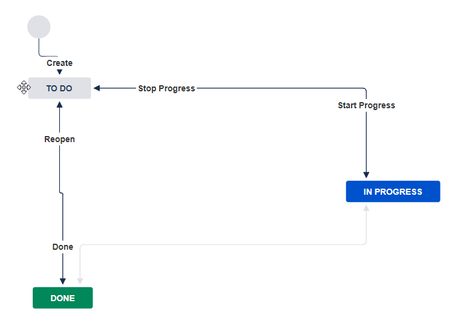

# 4. Projektorganisation
## 4.1. Organisationsformen
Die Organisation eines Projekts ist für dessen Erfolg von großer Bedeutung. Man unterscheidet dabei zwischen folgenden Formen:

Die **Linienorganisation** ist die Form die der Traditionellen Unternehmensstruktur am nächsten kommt.
Dabei werden Projekt- und Personalverwaltung nach Untergruppen oder nach Unterfunktionen strukturiert.\
Die klare Verantwortlichkeit der "Kommandokette" sowie die Spezialisierung der Organisationseinheiten ist hierbei von Vorteil.\
Nachteile sind das es eine hohe Anforderung an die Disziplin sowie lange Kommunikationspfade gibt.
Außerdem ist eine abteilungsübergreifende Zusammenarbeit kaum möglich, da zwischen diesen klar getrennt wird.

Bei der **Matrixorganisation** sind Projekt- und Personalverwaltung voneinander getrennt und jeder Mitarbeiter hat somit zwei Vorgesetzte.
Die Koordination zwischen diesen beiden Instanzen ist daher essentiell.\
Vorteile dieser Organisationsform sind das eine straffe Projektführung möglich ist, da die Projektverwaltung sich nur um eben dieses kümmern muss.
Außerdem können Kapazitäten flexibel zugeordnet und innerhalb der Führungshierarchie ist eine Teilung der Aufgaben möglich.\
Die hohe Anzahl an Führungskräften kann Mitarbeiter überfordern und daher auch zum Nachteil werden.
Die Koordination zwischen den beiden Verantwortungsinstanzen hat einen hohen Aufwand was zum Risiko eines unkontrollierten Projektegoismus beiträgt.
Innerhalb des Unternehmens kann es zu Konflikten kommen, da die Projektorganisation oft von der Unternehmensstruktur abweicht.
Bei parallel laufenden Projekten kann es außerdem zu Konflikten bei der Zuordnung von Mitarbeitern kommen.

Als letzte Form ist noch die **Multiprojektorganisation** zu nennen,
in der Spezialisten in mehreren Projekten in ihrem jeweiligen Spezialgebiet eingesetzt werden.\
Die flexible und kurzzeitige Kapazitätszuordnung und die optimale Versorgung der Projekte mit Expertise sind Vorteile dieser Organisationsform.
Des weiteren gibt es einen schnellen Erfahrungstransfer zwischen ähnlichen Projekten und es kann sich stark auf die jeweiligen Kernaufgaben konzentriert werden.\
Nachteile sind die erhöhte Ressourcenkonkurrenz zwischen Projekten, der hohe Koordinationsaufwand und die Komplexe Vorgesetztenstruktur.
Zusätzlich schlagen Planabweichungen auf mehrere Projekte durch.

Bei der **Wahl der Organisationsform** müssen die Organisation des Unternehmens sowie die Charakteristika des Projekts berücksichtigt werden.
Man sollte die Fragen "Wer entscheidet?", "Wer ordnet konkrete Maßnahmen an?" und
"Wie wird Transparenz in Führungs- und Entscheidungsstrukturen hergestellt?" beantworten.

## 4.2. Rollen / Teambildung
### Rollen
Der Begriff **Rolle** bezeichnet eine bestimmte Funktion, die eine Person oder Organisationseinheit wahrnimmt.
Eine Rolle definiert ein Aufgaben- und ein Fähigkeitsprofil. Rollen werden von Einzelpersonen, Teams oder Organisationseinheiten ausgeübt.
Eine Rolle bezeichnet die Menge aller Fähigkeiten, Kenntnisse und Verhaltensweisen, die eine Person benötigt, um eine bestimmte Aufgabe wahrzunehmen.\
Wesentliche Rollen sind die Projektleitung und das Qualitätsmanagement.
Die Aufgaben des Projektleiters umfassen die Definition des Projektumfangs, die Organisation und Motivation des Projektteams,
Zeit-, Kosten-, und Qualitätsvorgaben auszubalancieren, Lieferanten und Unterauftragnehmer zu managen und Abnahmen sowie Lieferungen zu organisieren.\
Das Qualitätsmanagement entwickelt eine Qualitätsdefinition, in der eindeutig definiert ist,
was für alle Projekte unter Qualität zu verstehen ist und eines Qualitätsprogramms mit Standards, Verfahren, etc.
Des weiteren ist es für regelmäßige Überprüfungen des Entwicklungsprozesses zuständig, die gewährleisten sollen das Qualitätsvorgaben eingehalten werden.
Eine weitere Aufgabe des Qualitätsmanagements ist das Definieren, Sammeln, Protokollieren und Berichten von Kenngrößen
mit denen die Effektivität des Qualitätsprogramms aufgezeigt werden kann.
Hinzu kommt hier noch das Erstellen und Pflegen eines Prozesses zur Bewertung und ständigen Verbesserung des Qualitätsprogramms.

### Teambildung
Zusätzlich zur organisatorischen und fachlichen Strukturierung ist für ein erfolgreiches Projekt auch die Personalstrukturierung von Bedeutung.

Ein erfolgreiches Team sollte fachlich und sozial ausgewogen sein, es sollten Anerkennung und Vertrauen zum Team herrschen,
die Zielstellung und Aufgabenverteilung sollten klar sein, es sollte eine offene Kommunikationsatmosphäre geben, die kritische Diskussionen ermöglicht.\
Es gibt auch innerhalb von Teams verschiedene Organisationsstrukturen.
Grundsätzlich kann man sagen das es eine **Teamleitung** sowie **Zuständige** für Einzelaufgaben geben sollte.\
Ein Team kann entweder **Hierarchisch** organisiert sein, dass bedeutet das es eine klare Zuordnung von Verantwortung und Zuständigkeiten gibt.
Ein Nachteil ist, das Konflikte bei Abteilungsübergreifenden Projekten entstehen können.\
Aber es kann auch **Demokratisch** organisiert sein, indem Gruppenentscheidungen kollektiv getroffen werden,
was zu einer höheren Motivation der einzelnen Mitglieder führen soll.
Langwierige Entscheidungs- und Koordinationsprozesse können zu Problemen werden und diese Form eignet sich nicht für größere Gruppen.

## 4.3. Management(verfahren) / Aufgaben des Managements
## 4.4. Projekt-/Arbeitsplanung
Eine wichtige Aufgabe des Managements eines Softwareprojekts ist die Projektplanung.
In dieser Planung werden die Vorgaben der zu erbringenden Arbeitsleistung, sowie deren Termine, festgelegt und die Ressource und zulässigen Kosten kalkuliert.
Zuerst wird ein initialer Projektplan erstellt.

### Projektstrukturplan
Der Projektstrukturplan ist dafür da, um für ein großes Projekt einen besseren Überblickt zu bekommen.
Hierbei wird das Projekt in kleinere und übersichtlichere Arbeitspakete und Teilprojekte zerlegt.

#### Erstellung
Zur Erstellung des Plans können folgende zwei Methoden benutzt werden:

###### Top-Down
Bei Top-Down wird die gesamte Problemstellung betrachet und schrittweise zerlegt und verfeinert. Dafür müssen vorher Strukturierungskriterien definiert werden, die für das Zerlegen benötigt werden.

###### Bottom-Up
Bei der Bottom-Up Methode werden zuerst im Brainstorming alle Einzelaktivitäten gesammelt und dann von unten nach oben definiert.

Um den Projektstrukturplan zu überprüfen, gibt es folgende Bedingungen, die erfüllt sein müssen:
###### Disjunktionsbedingung
Die Elemente einer Ebene müssen sich vollständig voneinander unterscheiden.

###### Vollständigkeitsbedingung
Der Inhalt der zerlegten Elemente müssen zusammen wieder das Ursprungselement ergeben. Es darf also bei der Zerlegung nichts verloren gehen.

#### Strukturierungskriterien
Die Strukturierung von einem Projekt in Teilprojekte kann nach unterschiedlichen Strukturierungskriterien erfolgen.
Ein paar Beispiele sind die Gliederung nach Disziplinen, Architektur und Aufbau der Software und Verantwortung.

#### Arbeitspakete
Arbeitspakete legen die durchzuführenden Arbeiten fest. Sie sind eine in sich abgeschlossene Tätigkeit mit festgelegter Dauer, Zuordnung von Personal- und Betriebsmitteln und logischen und zeitlichen Abhängigkeiten zu anderen Arbeitspaketen.
Bei Arbeitspaketen sollte die ordnungsgemäße Durchführung überwacht und festgelegt werden. Dafür können Statusinformationen und Workflows für Arbeitspakete verwendet werden.
Ein Arbeitsauftrag kann zum Beispiel die Zustände Vorgeschlagen, Aktiv, in Bearbeitung, Abgeschlossen oder Erledigt annehmen. Die Zustände dürfen nur in einer festgelegten Reihenfolge erreicht werden.
Durch die Überwachung kann die gesamte Tätigkeitsliste analysiert werden und ein groben Überblick über den Status der Arbeit liefern.

### Meilensteinplanung
Mit Meilensteine werden Projektfortschritt und Qualität kontrolliert. Meilensteine werden in der Meilensteinplanung erfasst, der in den Projektstrukturplan integriert sein kann. Besonders geeignet hierfür sind Gantt-Diagramme.
!!BILD!!

Im Meilensteinplan werden Projektfortschrittstufen und Zwischenresultate des Projektverlaufs vorgegeben. Für das Erreichen von Meilensteinen ist die Qualität der zum Meilenstein fertig zu stellenden Produkte zu überprüfen und zu dokumentieren.
Die Bestimmung der Meilensteine erfolgt unterschiedlich je nach verwendetem Vorgehen im Projekt. Bei einer agilen Vorgehensweise werden Meilensteine auch an regelmäßigen Releases der Projektergebnisse geknüpft. Weitere Kriterien für Meilensteine sind kritische, nicht verrückbare Daten.

#### Meilenstein
Ein Meilenstein definiert einen zu erreichenden Entwicklungsstand im Projekt, meist durch Beschreibeung von Projektergebnissen.
Er braucht keine Ressourcen, ist überprüfbar beschrieben (nicht erlaubt ist zum Beispiel "Programm zu 90% fertig") und von kurzer Dauer (zum Beispiel 2-4 Wochen).

#### Eigenschaften
Meilensteine können auf unterschiedliche Arten gefunden und festgelegt werden. Folgende Eigenschaften sind zu beachten:
* Überprüfbarkeit
	- Mit dem Erreichen des Meilensteins ist ein oder mehrere Artefakte erledigt. Die Fertigstellung ist messbar überprüfbar.
* Kurzfristigkeit
	- Um dem Projekt genügend Zeit zum Arbeiten zu geben, gleichzeitig aber Verzögerungen frühzeitig zu erkennen, sind Abstände zwischen Meilensteinen kurz zu wählen.
* Gleichvereteilung
	- Meilensteine sollten gleichmäßig zu verteilen und eine ausgewogene Fortschrittskontolle zu ermöglichen.

#### Zeitliche Verteilung
Der zeitliche Abstand von Meilensteinen sollte relativ kurz sein (etwa 3-4 Wochen), um den Projektfortschritt gut kontrollieren zu können. Beachtet werden muss, dass die Zeit zwischen den Meilensteinen weder zu gering noch zu groß ist. Bei zu geringem Abstand bleibt zu wenig Zeit für die inhaltliche Arbeit, da kontinuierlich Meilensteine vorzubereiten sind. Ist der Abstand zu groß, können Fehlentwicklungen im Projekt zu spät erkannt werden.

#### Feststellen der Zielerreichung
Meilensteine sind Zwischenziele im Projekt. Diese müssen regelmäßig kontrolliert werden. Wenn ein Meilenstein erreicht wird, werden die Artefakte des Meilensteins überprüft.

#### Blockierende Meilensteine
Blockierende Meilensteine sind von Entscheidungen abhängig, die den weiteren Projektablauf beeinflussen können. Sie werden in der Projektplanung früh festgelegt.
Die Entscheidungsfindung wird in der Regel ausßerhalb des Projektteams erfolgen. Typische blockierende Meilensteine sind zum Beispiel: Projekt genehmigt, Andorderungen festgelegt, Projekt beauftragt, Abnahme erfolgt.

### Netzplantechnik
Aufgrund der Abhängigkeiten und der Zusammenhänge zwischen Aufgaben und Ressourcen können die Zeitpunkte für die Durchführung von Tätigkeiten mithilfe der Netzplantechnik berechnet und grafisch dargestellt werden. Mit dem Netplan kann man bestimmen wie lange das Projekt mindestens dauern wird, welche Arbeitspakete das Projekt verzögern können, ob das Projekt im Zeitplan ist und ob es früher oder später fertig werden wird.
Durch ihn hat man früh ein Gesamtbild des Projektes und kann frühzeitig die benötigte Bearbeitungsdauer für das Projekt abschätzen.

#### Darstellung von Netzplänen
##### MPM-Netzplan
Der MPM-Netzplan wird auch als Standard-Netzplan bezeichnet. Die Knoten des Plans stellen Vorgänge dar und die Pfeile die logischen Abhängigkeiten.

##### Vorgangspfeil-Netzplan
In einem CPM-Netzplan stellen die Pfeile die Vorgänge dar. Die Knoten stellen die Abhängigkeiten im Sinne von Anfangs- und Endereignissen eines Vorgangs dar.

##### Ereignisknoten-Netzplantechnik
Der PERT-Plan ist ein ereignisorientierter Netzplan. Die Knoten stellen die Ereignisse dar und die Pfeile deren Abhängigkeiten. Die Dauer der Tätigkeiten wird nicht fix angegeben, sondern durch erwartete frühste und späteste Termine bestimmt.

#### 4.4.2.2 Kritische Pfade und Optimierung
Wichtig bei der Planung ist ein Optimierungsziel. Zum einen will man den benötigten Aufwand klein halten und zum anderen die gesamte Entwicklungsdauer mit maximalem Aufwand minimieren.
Ein Kritischer Pfad sind die Vorgänge, die bei zeitlicher Änderung, den Endtermin des gesamten Netzplans verschieben. Es gibt immer mindestens einen kritischen Pfad im Netzplan.

##### Probleme in der Anwendung
Die Netzplantechnik ist eine allgemeine Methode zur Projektplanung. Folgende Probleme tauchen bei der Anwendung in der Softwareentwicklung auf:

###### Randbedingungen
Der Ausgleich der Randbedingungen, zum Beispiel durch Einfluss anderer Projekte und Fehlzeiten, ist schwer in einem Netzplan zu berücksichtigen.

###### Abhängigkeiten
Es gibt nicht immer so feste Abhängigkeiten zwischen Vorgängen. Netzpläne zeigen somit eine Präzision an, die sie möglicherweise garnicht haben.

###### Detailierungsgrad
Da man Teilaufgaben häufig vorziehen kann, ist im Netzplan eine Untergliederung des Projekts erforderlich. Dadurch kann ein Netzplan nicht mehr sinvoll anwendbar sein.

Die Netzplantechnik eignet sich gut für die Grobplanung des Projekts. Aufgrund der schnell erreichten Komplexität, sollte man Werkzeuge nutzen, die die entsprechenden Techniken anbieten.

### Balkenplantechnik
Der Projektstrukturplan zeigt die Abhängigkeiten der Arbeitspakete. Der Nachteil an Netzplänen ist, dass die Möglichkeiten, dass mehrere Arbeitspakete parallel laufen können, nicht dargestellt werden können.

#### Darstellung als Gantt-Diagramm
Mithilfe eines Gantt-Diagramm ist es Möglich Projektpläne als Balkendiagramme darzustellen. Hierbei werden Zeiten und Dauer von Vorgängen auf einer Zeitachse angeordnet und in Beziehung gesetzt.
Die Vorgänge werden in die erste Spalte der Tabelle eingetragen. Die Zeitachse wird in der ersten Zeile dargestellt. Mit waagerechten Balken werden dann die jeweiligen Vorgänge visualisiert. Je länger der Balken, desto länger der Vorgang.

##### Vernetzte und unvernetzte Gantt-Diagramme
In einem unvernetzten Plan sind alle Vorgänge eingetragen, jedoch gibt es keine Abhängigkeiten zwischen den Vorgängen. Die Abhängigkeiten werden erst im späteren Verlauf definiert und eingetragen. Als Ergebnis entsteht ein vernetzter Gantt-Plan.

##### Personen- vs. aufgabenbezogene Gantt-Diagramme
Ein aufgabenbezogenes Diagramm ist, wenn die Vorgänge des Projekts in den Zeilen enthalten und deren Dauer der Zeitachse eingetragen sind. Bei jedem Vorgang sind auch die Bearbeiter angegeben. Durch diese Sicht kann man das Gesamtprojekt im Auge behalten. Wenn man aber wissen möchte, welcher Mitarbeiter welche Aufgaben betreut ist ein personenbezogenes Gantt-Diagramm vom Vorteil.

#### Beziehungen und Abhängigkeiten
Die Pfeile der Abhängigkeiten in der Netzplantechnik wie auch bei Gantt-Diagrammen haben eine besondere Bedeutung. In der Balkenplantechnik und auch in der Netzplantechnik werden die Beziehungen jedoch über einfache logische Abfolgen weiter verfeinert.

##### Normalfolge
Wenn Vorgang A abgeschlossen sein muss bevor Vorgang B begonnen werden kann, spricht man von einer Normalfolge.

##### Anfangsfolge
Wenn der Beginn eines Vorgangs A die Bedinung dafür ist, dass ein Vorgang B begonnen werden kann, spricht man von einer Anfangsfolge.

##### Endfolge
Wenn der Abschluss eines Vorgangs A die Bedingung dafür ist, dass ein Vorgang B beendet werden kann, spricht man von einer Endfolge.

##### Sprungfolge
Wenn der Abschluss eines Vorgangs B die Voraussetzung dafür ist, dass ein Vorgang A begonnen werden kann, spricht man von einer Sprungfolge.

### Philosophien zur Projektplanung
Die Projektplanung kann sich an unterschiedliche Philosophien orientieren. Es kann eine meilensteinbasierte Planung sein oder eine Time Boxing Planung.

#### Meilenstein-orientierte Planung
Meilensteine sind in der Meilenstein-orientierten Planung das Grundgerüst. Sie lassen sicht recht einfach identifizieren. Auch Vorgehensmodelle enthalten in der Regel Meilensteine. Sie sind dabei keine zeitlich fixierten punkte, sondern variable Elemente des Projektplans.

#### Fast Tracking
Eine Technik, die meilensteinorientiertes, paralleles Arbeiten erlaubt ist das Fast Tracking. Das Fast Tracking eignet sich besonders für produktzentriete Vorgehensmodelle wie das V-Modell. Es wird festgelegt, wann ein Artefakt spätestens fertiggestellt und qualitätsgesichert werden muss. Weiterhin ist festgelegt, welche Abhängigkeiten zwischen den einzelnen Artefakten besteht. Somit kann ermittelt werden, welche Artefakte zuerst und welche auf dieser Grundlage erstellt werden können.

#### Time Boxing
Als Alternative zur meilensteinorientierten Projektplanung gibt es das Time Boxing. Hierbei werden Zeitpunkte für die Überprüfung des Projektstandes festgelegt. Typische Überprüfungszeitpunkte ist ein Abstand von vier bis sechs Wochen. Im Extremfall werden die geplanten Projektergebnisse in der vorliegenden Form ohne Umplanung in den nächsten Projektabschnitt übernommen. Das heißt, dass beim Time Boxing keine Änderungen an der Zeitplanung gemacht werden. Stattdessen werden Umfang oder Qualität der Artefakte angepasst.

### 4.4.5. Aspekte von Projekt-/Arbeitsplanung in Projektmanagementwerkzeugen
Ein Hauptaspekt vieler Projektmanagementwerkzeuge liegt auf dem Abbilden von Arbeitspaketen in sogenannten *Tasks* oder *Issues*. Meist können mehrere Tasks zu *Milestones* zusammengefasst werden.

**Github** etwa unterstützt das Erstellen und Zuweisen dort genannter *Issues*. Sie können mit Labeln versehen werden, um z.B. Dringlichkeit abzubilden. **Trello** erweitert diese Funktionalität um die Möglichkeit ein *Due-Date* festzulegen. In **Gitlab** existiert zusätzlich eine Timetracking-Funktionalität. Auch **Jira** bietet diese Features ebenfalls und ergänzt diese um die Möglichkeit der direkten Priorisierung. All diese Tools erlauben außerdem das granulare Beschreiben von Arbeitspaketen in Checklisten und eine Diskussions-Funktion für Kommunikation betreffend einzelner Tasks. In **MS-Project** existieren die eher abgespeckten *Vorgänge*, die eine ähnliche Funktion erfüllen. Dort können jedoch Abhängigkeiten von Arbeitspaketen im Sinne eines *Projektstrukturplans* abgebildet werden. In **Jira** kann das z.B. über das Abbilden von Tasks in einer Hirachie mithilfe von Sub-Tasks erreicht werden.

  
Timetracking in **Jira**

  
Timetracking in **Gitlab** über "Quick-Actions"

Mithilfe von **MS-Project** können Arbeitspaketen Ressourcen zugewiesen werden. Übliche Ressourcen können etwa Personen, Material oder Ausrüstung sein.

  
Ressourcenmanagement in **MS-Project**  
Es können stündliche Kosten und wöchentliche Arbeitszeiten festgelegt werden. Mit Hilfe dieser Daten lassen sich Kostenberichte oder Schätzungen zu Machbarkeit von Tasks erzeugen.

#### Vergleich: Arbeitspakete in Projektmanagementtools

Funktionalität | Github | Gitlab | Trello | Jira | MS-Project
--- | --- | --- | --- | --- | ---
Arbeitspakete | ✔ | ✔ | ✔ | ✔ | ✔
Zusammenfassen in Milestones | ✔ | ✔ | ✔ | ✔ | ✔
Labeling | ✔ | ✔ | ✔ | ✔ | 🗙
Priorisierung | über Labels | über Labels | über Labels | ✔ | ✔
Zeitplanung (Due-Date) | 🗙 | ✔ | ✔ | ✔ | ✔
Timetracking (inkl. Schätzung) | 🗙 | ✔ | 🗙 | ✔ | ✔
Checklisten | ✔ | ✔ | ✔ | ✔ | 🗙
Diskussion | ✔ | ✔ | ✔ | ✔ | 🗙
Abhängigkeiten | 🗙 | 🗙 | 🗙 | über Sub-Tasks | ✔
Ressourcenmanagement | 🗙 | 🗙 | 🗙 | 🗙 | ✔

Alle genannten Tools ermöglichen eine Darstellung von Arbeitspaketen auf *Kanban-Boards*. Mit **Github** und **Jira** lassen sich diese zusätzlich automatisieren. **MS-Project** und **Jira** bietem als einzige Tools eine integrierte Darstellung als *Gantt-Diagramm* an.

  
Kanban-Board in **Github**  
Für jede Spalte kann ein Verhalten festgelegt werden. Tasks werden so automatisiert verschoben.

  
Gantt-Diagramm in **MS-Project**  
Das Gantt-Diagramm ist eine mächtige Ansicht, in der sich schnell viele Informationen ablesen lassen. In diesem Beispiel lässt sich zum Beispiel der Fortschritt eines einzelnen Tasks und Abhängigkeiten erkennen.

#### Vergleich: Darstellung von Arbeitspaketen in Projektmanagementtools

Funktionalität | Github | Gitlab | Trello | Jira | MS-Project
--- | --- | --- | --- | --- | ---
Kanban-Board | ✔ | ✔ | ✔ | ✔ | ✔
Automatisierung | ✔ | 🗙 | 🗙 | ✔ | 🗙
Gantt-Diagramm | 🗙 | 🗙 | 🗙 | ✔ | ✔

Die Task-Automatisierung in **Jira** ist durch sogenannte *Workflows* realisiert. Dort kann Verhalten für Tasks bei Status-Änderung definiert werden.

  
*Simples Beispiel eines Task-Workflows in **Jira** *  
In Form von Zustandsdiagrammen können bei definierten Aktionen der Status von Tasks automatisch geändert werden.

**Jira** bietet des Weiteren eine sehr mächtige *SQL*-Ähnliche Query-Language zum filtern von Tasks, die *JQL*. Mit ihr lassen sich sehr spezifische Ansichten erzeugen.

  
Simples Beispiel einer JQL-Abfrage in **Jira**  
In diesem Beispiel können Tasks durch simple Angabe von Filterbedingungen alle Tasks aus dem Projekt "Musterprojekt", die diese Woche erstellt wurden geordnet nach Zeitpunkt der Erstellung angezeigt werden.

## 4.5. Projektinfrastruktur
Ein wichtiger Punkt im Projektmanagement ist die Infrastruktur.
Durch passende Werkzeuge kann das Team von zeitraubenden Routineaufgaben entlastet werden.

Für folgende Punkte müssen Anforderungen definiert, die Umgebung installiert und für das Team bereitgestellt werden:

#### Hardwareumgebung
Zur Hardwareumgebung gehört die Hardware für:
* die Entwicklung,
* das Testen,
* den Produktivbetrieb

#### Kommunikationsumgebung
Zur Vernetzung gehört:
* die Kommunikation im Team mit z. B. mit Telefonen und Videokonferenzsystemen
* ein Druckerzugriff
* eine zentrale Ablage, z. B. Wikis
Eine schnelle und zielgerichtete Kommunikation ist für ein Projekt von hoher Bedeutung, da sonst wichtige Informationen zu spät übermittelt werden oder verloren gehen können.

#### Projektablage
Zur Projektablage gehören:
* die Dokumente der Projektinitiierung
* die Angebote und Verträge
* Planungs- und Steuerungsdokumente
* Projekttagebuch
* Korrespondenz und Aufzeichnungen
* Angaben zur technischen Infrastruktur und zur Administration

### 4.5.1. Aspekte von Projektinfrastruktur im Bezug auf Projektmanagementwerkzeuge

#### Repository

Als zentrale Datenablage wird häufig auf *Repositories* (Versionsdatenbank) gesetzt. Da in vielen Projekten das Repository eine grundlegende Kernkomponente darstellt, ist eine exakte Strukturierung und ein organisierter Umgang erforderlich.

**Struktur**  
Um die wiederfindbarkeit von Daten zu ermöglichen, ist es erforderlich eine (Verzeichnis)Struktur festzulegen.

**Rechte**  
Es muss klar definiert werden, wer Schreib- und Leseberechtigung auf welches Verzeichnis hat.

**Bearbeitungsregeln**  
Es kann erforderlich sein, Regeln für die Benennung von Artefakten festzulegen. Weiterhin kann definiert sein, welche Dateitypen im Repository abgelegt werden dürfen und müssen. Die Festlegung einer Konvention für Check-In-Kommentare / Commit-Messages erleichtert ebenfalls die Arbeit mit dem Repository.

**Verantwortung**  
Es muss klar definiert werden, wer die Verantwortung für das Repository hat. Der Verantwortliche setzt die Einhaltung festgelegter Regeln um. Von Zeit zu Zeit ist das Aufräumen des Repositorys sinnvoll.

##### Repository-Software

Als bekannte und verbreitete Repository-Software ist zum Beispiel das freie aber bereits eingestellte **CVS (Concurrent Version System)**, das ebenfalls freie **Apache Subversion** oder das weit verbreitete, freie und dezentrale **GIT** zu nennen. Das ebenfalls freie und verteilte **Mercurial** kann zum Beispiel Differenzen binärer Dateien erzeugen.

Als kommerzielle Repository-Software findet z.B. **Team Foundation Server** von Microsoft direkte Integration in **MS-Project**. IBM entwickelt mit **IBM Jazz** ebenfalls eine proprietäre Repository-Software. Eine weitere weit verbreitete kommerzielle Versionsverwaltungssoftware ist **Perforce**.

###### Vergleich: Repository-Software

Eigenschaft | CVS | Subversion | GIT | Mercurial | Team Foundation Server | IBM Jazz | Perforce
--- | --- | --- | --- | --- | --- | --- | ---
Lizenz | frei | frei | frei | frei | proprietär | proprietär | proprietär
Dezentral | 🗙 | 🗙 | ✔ | ✔ | 🗙 | 🗙 | 🗙

#### Integration

Eine mögliche Anforderung an Projektmanagementwerkzeuge kann die Integration untereinander sein. So müssen Daten nur an einer Stelle verwaltet werden, können aber in verschiedenen Umgebungen genutzt werden.

**Trello** ermöglicht eine Integration zu den meisten Projektmanagementtools. Ebenfalls lassen sich **Github** und **Gitlab** zu **Jira** integrieren. **MS-Project** ist zu Integration mit Produkten, die nicht von Microsoft stammen nicht geeignet.

Sollte zur Kommunikation auf **Slack**, ein weit verbreiteter Messenger für Projektteams, gesetzt werden lassen sich die genannten Tools bis auf **MS-Project** auch dort direkt integrieren. So können zum Beispiel automatisch Benachrichtigungen zu Statusänderungen bei Tasks versendet werden oder Tasks gar aus dem Messenger verhaltet werden.
