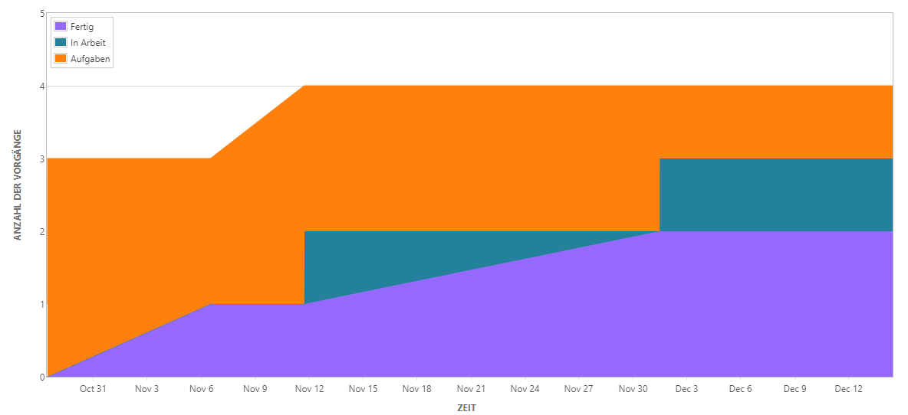

# 6. Projektfortschritt
## 6.1. Projektfortschrittskontrolle
Aufrechthaltung der organisatorischen Rahmenbedingungen für das Projekt z.B., dass das Projektteam arbeitsfähig bleibt (möglichst wenige oder keine Überlasten (z.B. Überstunden entstehen) und dass zum Beispiel in der Interaktion mit dem Kunden Änderungsforderungen nicht unkoordiniert in das Projekt finden)

### Grundsätzliches zur Fortschrittskontrolle
Hier werden wesentliche Aspekte des Projekts überwacht und gesteuert.
Bewältigung von unerwarteten Schwierigkeiten, die Überwachung und Dokumentation des Projektfortschritts. Einhaltung von Kosten, Terminen und Qualitätsvorgaben.

- regelmäßige (beispielsweise monatliche) Fortschrittsberichte
- regelmäßige (beispielsweise wöchentliche) Projektbesprechungen
- Überprüfung der Resultate durch Qualitätskontrollmaßnahmen

### Prinzipen der Fortschrittskontrolle
Es gibt viele Prinzipen der Fortschrittskontrolle, wie die Motivation der Mitarbeiter, damit die Stimmung intern nicht geschädigt wird. Daher sollten vertrauensvolle und offene Gespräche mit Mitarbeiter entstehen. Mitarbeiter sollten über Projektziele und Rahmenbedingungen informiert werden. Probleme sollten offen besprochen werden. Alle sollten die Möglichkeit haben Vorschläge einzubringen

Die Überprüfung und Statuskontrolle sind meist nicht gern von Mitarbeitern gesehen, da sie sich „beobachtet“ fühlen. Man sollte das offen bereden, damit keine schlechte Stimmung herrscht.

Im Berichtswesen sind alle Informationen zum Projekt eingetragen:

- Ergebnisse unabhängiger Kontrollmechanismen
- Termin- und Arbeitspläne
- Ist-Stands des Projekts in Bezug auf die Soll-Vorgaben
- Identifikation von Problemen und der Festlegung von Maßnahmen

Auftretende Abweichungen von der Planung müssen so früh wie möglich erkannt und behandelt werden bei der Planung des Projekts.
Ziel der Fortschrittskontrolle ist zu prüfen, ob das Projekt im Planungszeitraum liegt. Dazu die Identifizierung von Fehlplanungen oder Umplanungsbedarf. Abweichung von den Vorgaben müssen erfasst, analysiert und dokumentiert werden. Dienen zur Anpassung, aber auch zur Optimierung der Planungs- und Schätzmethoden. Hier werden potenzielle Projektrisiken entdeckt und müssen entsprechend berücksichtigt werden.

### Projektbesprechungen
Projektbesprechungen sind wichtige Bestandteile der Projektkoordination. Projektleiter sowie das Projektteam bekommen den aktuellen Zustand des Projekts sowie auftretende Schwierigkeiten oder Koordinationserfordernisse mit. Die Besprechungen sind auch von psychologischer Bedeutung und beeinflussen Motivation und Stimmung im Team.
Projektbesprechungen sollten nicht mehr als zwei Ebenen in der Organisationshierarchie betreffen, sprich Projektleiter und die Ebene darunter die „Co-Projektleiter“. Ziel dabei ist gegenseitiger Informationstausch, Identifizierung gemeinsamer Probleme, Koordination, Vorbereitung projektspezifischer Entscheidungen.
Es sollten dennoch auch solche Besprechungen regelmäßig mit dem Projektteam stattfinden. Hier werden aktuelle Arbeitsaufträge geprüft, deren Status festgestellt, gegebenenfalls Umplanungen vorzunehmen oder neue Arbeitsaufträge zu vergeben. Risiken sollten auch besprochen werden.

##### Im Agilen Umfeld
Projektbesprechungen sind abhängig von Unternehmens- und Projektkultur.
Bei Scrum gibt es kurze und knappe tägliche Besprechungen „Daily-Scrum“.

#### Herbeiführen einer Projektfortschrittentscheidung
Die Verantwortung liegt hierbei bei dem jeweiligen Projektleiter. Das Ziel dabei ist die ständige Übersicht über den aktuellen Projektstand zu behalten. Dazu ist die Schaffung einer Entscheidungsgrundlage essenziell, sodass entschieden werden kann, ob das Projekt so noch durchgeführt werden kann.

## 6.2. Berichtswesen
Eine objektive, transparente und gut dokumentierte Fortschrittskontrolle ist wichtig um die Fertigstellung abzuschließen.
Die Dokumentierung zwingt das Management, sowie den anderen Beteiligten sich über den Stand des Projektes bewusst zu werden und Rechenschaft abzulegen. Die Berichte sollten ausgewertet werden umgegeben falls Korrekturschritte ein zu leiten. Im Berichtswesen fließen alle Informationen aus der Projektfortschrittskontrolle zusammen. Das Berichtswesen ist dafür da alle Beteiligten auf den gleichen Fortschritt zu bringen.

Das Berichtwesen sollte folgende Kernfragen beantworten können:
- Was ist der aktuelle Gesamtprojektstatus?
- Ist das Projekt noch im Kosten-/Zeitplan?
- Was ist der fachliche Fortschritt?
- Was sind aktuelle Problem und Risiken?
- Sind in Zukunft Probleme zu erwarten?

Projektstatusbericht
- Meilensteinliste für den Berichtszeitraum
- alle Meilensteine aufgelistet
- nicht erreichen eines Meilenstein muss begründet sein

Zur Darstellung bieten sich:
- Einfache Terminlisten an
- Ampelliste für die Kennzeichnung der Nicht-/Erreichung (rot/grün)
- Meilensteintrendanalyse

### 6.2.1. Aspekte zu Berichtswesen in Projektmanagementwerkzeugen

Unterstützung zur Projektfortschrittskontrolle in Projektmanagementtools kann einen variierenden Umfang haben. Während **Trello** kein solches Feature bietet **Gitlab** den minimalistischen Ansatz für jeden Meilenstein den Anteil der abgeschlossenden Tasks anzuzeigen. **Github** bietet ebenfalls eine simple Darstellung auf Projektebene.

  
Fortschritt eines Milestones in **Gitlab**

Dedizierte Projektmanagementtools wie **Jira** und **MS-Project** legen ein großes Augenmerk auf Reporting zur Unterstützung der Fortschrittskontrolle in Projekten.

**MS-Project** bietet einen sehr mächtigen Berichts-Editor der gänzliche Freiheiten zur Erstellung von Berichten zu diversen Kennzahlen lässt. Mit Hilfe dieser Berichte lässt sich einfach der Projektfortschritt visualisieren.

  
Vorgefertigter Bericht: Verspätete Vorgänge in **MS-Project**. Dieser Bericht berücksichtigt die Erreichbarkeit von Fristen mit Berücksichtigung der noch nötigen Arbeitszeit im Hinblick auf zugewiesene Ressourcen.  
In diesem Beispiel gilt ein Task beispielsweise als verspätet, obwohl das Enddatum in der Zukunft liegt. Die zugewiesenen Ressourcen unterschreiten die noch nötige Arbeitszeit. Der Task ist somit nicht einzuhalten.

Noch mächtiger ist die Reporting-Funktionalität von **Jira**. Dort können zum Beispiel Berichte zu der Bearbeitungsdauer von Tasks erstellt werden. So können Trends zu Verspätungen frühzeitig erkannt werden. Verschiedene weitere  Darstellungsformen ermöglichen einen schnellen Überblick über den Projektfortschritt.

  
Flussdiagramm in **Jira**. Sowohl Auslastung als auch Gesamtfortschritt lassen sich in dieser Darstellungsform ablesen.  
In diesem Beispiel ist zu erkennen, das vom 6. bis zum 12. November kein Task in Arbeit war. Möglicherweise wurde also in diesem Zeitraum potential verschenkt.
