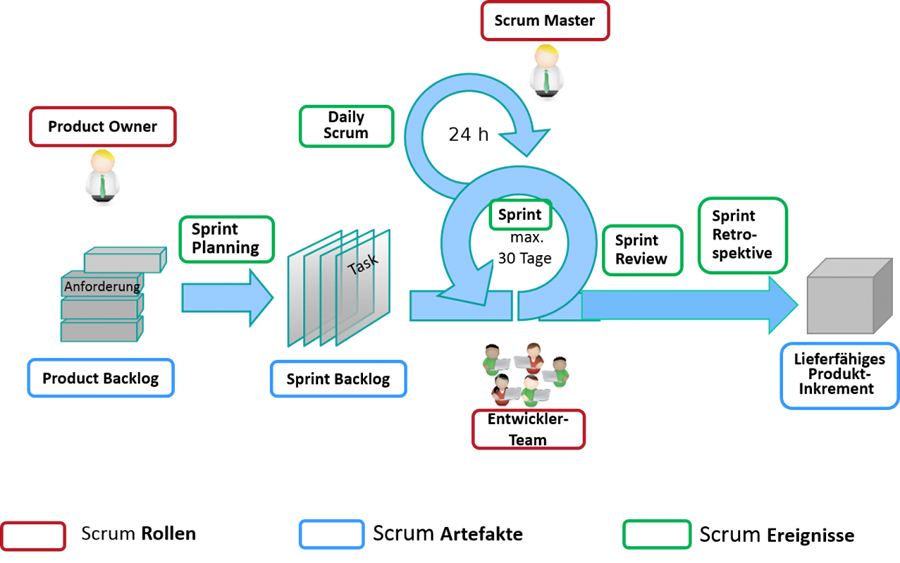

# 2. Projektorganisation und Projektmanagement im Software Engineering
## 2.1. Projekt- und Produktlebenszyklus von Software
Ein Projekt besteht aus mehreren, kleinen Einzelschritten, die im Projektlebenszyklus enthalten sind. In der Softwareentwicklung spricht man von drei verschiedenen Zyklen dem Projekt-, Software- und dem Produktlebenszyklus.
Der Softwarelebenszyklus beinhaltet das Projekt, in der die Software entsteht, bis zu seiner Abschaffung. Beim Entwickeln einer neuen Software wird in der Regel nicht nur ein Projekt durchgeführt, sondern mehrere kleine Teilprojekte. Die Software ist Teil eines Produkts, der Produktlebenszyklus beschreibt die Lebensdauer. Der Projektlebenszyklus wird grundsätzlich in vier Phasen aufgeteilt: Projektentstehung, Projektdefinition, Projektdurchführung und Projektabschluss.
In Unternehmen wird ein Projekt nach seiner Wirtschaftlichkeit und Machbarkeit ausgewertet, bevor es angegangen wird. Aus dem Portfolio entstehen dann Projekte und aus einem Projekt entstehen mehrere Aufgaben, die von den Projektmitarbeitern erledigt werden. Doch neben den projektbezogenen Aufgaben gibt es noch die projektübergreifenden Aufgaben. Diese umfassen zum Beispiel die Weiterentwicklung der Arbeitsweisen oder die Fortbildung der Mitarbeiter. Diese Aufgaben benötigen nicht die eigenen fachlichen Kompetenzen, sondern die der Projektmitarbeiter zu steigern. Die Erfahrungen aus jedem Projekt werden im sogenannten Knowledge Management festgehalten.

## 2.2. Phasen im Projektlebenszyklus
Die vier Phasen sind Bestandteil des Grundmodells, die in noch genauer an das Projekt angepasst werden. Es kann auch zu Überlappungen kommen je nach dem welchem Modell man nachgeht. Jede Phase besteht aus ihren eigenen Aufgaben. Neben den Phasenabhängigen Tätigkeiten gibt es noch die Aufgaben des Managements wie: Risikomanagement, Problem-, Fehler- und Änderungsmanagement, Qualitätsmanagement und Qualitätssicherung, Konfigurations- und Versionsmanagement
In der Projektentstehung findet die Entscheidung statt, ob ein Projekt überhaupt durchgeführt werden soll. Aus vielversprechende Projektideen gehen Skizzen und Projektaufträge hervor, um ein Projekt besser bewerten zu können. Projekte entstehen entweder aus eigenem Bedarf oder aus Bedarf von außen. In der Entstehung werden die Machbarkeit, die Risiken festgestellt und wenn das Projekt nach dieser Phase noch als durchführbar gilt, werden die grobe Anforderungen festgelegt, es gibt Schätzungen bezüglich des Aufwands und der Kosten, es wird ein Projektplan erstellt und die Wirtschaftlichkeit wird untersucht. Abschließend wird eine Projektvereinbarung getroffen, beziehungsweise ein Vertrag, wenn es sich um einen externen Kunden handelt. In dieser Phase ist es wichtig besonders behutsam die Kostenschätzungen zu machen, um den Projekterfolg nicht zu gefährden.
In der Projektdefinition wird ein Projekt ausgeplant, wichtig hierfür ist das Projekt-Set-Up. Das Projekt-Set-Up beinhaltet die Struktur des Projektes, die Projektinfrastruktur, die Bildung des Projektteams, die Zuständigkeiten, Projektrollen, Projekthandbuch und die Organisation des Projekt-Kick-Offs.
Das Set-Up ist dafür gedacht, dass alle eine genaue Vorstellung haben in welche Richtung das Projekt gehen wird. Ein wesentlicher Bestandteil ist auch die Definition eines Projektmanagementverfahrens, dessen wesentliche Bestandteile sind das Risikomanagement, Problem und Änderungsmanagement, Versions- und Konfigurationsmanagement und das Berichtswesen. Ein anderer wichtiger Punkt ist das Festlegen der QS-Verfahren und das Bereitstellen der Infrastruktur. Abschließend wird die Projektplanung, die verschieden Zeitpläne enthält, gemacht.
In der Projektdurchführung wird das Projekt umgesetzt. Die Projektteam muss sich um Aufgaben kümmern wie den Projektfortschritt zu kontrollieren, die Qualitätskontrolle, das Management der Projektressourcen, die Dokumentation, Organisation der Projektarbeit und Probleme zu erkennen und zu lösen. Die Projektleitung übernimmt dabei die Rolle des Kontrollelements, sie muss den Projektfortschritt und die Qualität permanent überprüfen und wenn nötig in die richtige Richtung lenken. Sie sind für den Erfolg verantwortlich und das anstehende Termine eingehalten werden.
Beim Projektabschluss werden die Ergebnisse übergeben und die Erfahrungen festgehalten. Wiederverwendbare Ergebnisse sollten festgehalten werden und die Ressourcen müssen wieder freigegeben werden.

## 2.3. Phasen der Softwareentwicklung
Die meisten Softwareprojekte scheitern an zu knapp bemessenen Ressourcen. Die Ressourcen, die man bei der Planung berücksichtigen soll, sind das Personal, die Werkzeuge, Räumlichkeiten, Finanzbudgets, Rahmenbedingungen und die Vorgaben. Die Projektziele müssen auf die Ressourcen abgestimmt sein und umgekehrt. Neben den Ressourcen haben auch die Vorgaben einen Einfluss auf die Projektdurchführung, wie zum Beispiel: Verträge, Anforderungen, Terminplan, Budgetplan, Qualitätsvorgaben und Vorgaben zur Verantwortungsaufteilung.
Das **V-Modell** ist das Grundmodell in Sachen Softwareentwicklung.
 
Oft hält man sich an die Phasen nur sehr grob oder einzelne Phasen überlappen oder das V-Modell bietet die Basis für ein genaueres, verfeinertes Modell.

### Erfassung und Verfeinerung der Anforderungen
Die Anforderungen müssen iterativ verfeinert werden und am Besten in einem Pflichtenheft festgehalten werden. Man kann Anforderungen spezifizieren oder neue hinzufügen, allerdings darf man nicht über die Stränge schlagen und muss die Kernansprüche im Auge behalten.

### Systementwurf
Für den Systementwurf ist eine genaue Formulierung der Architektur vorausgesetzt. Diese Phase konzentriert sich auf die Planung und Qualitätssicherung. 

### Implementierung, Verifikation und Test
In dieser Phase findet die höchste Arbeitsleistung statt, die Projektleitung muss koordinieren und das Team die Software entwickeln. Ein häufig auftretender Fehler ist das Projektteam zu früh starten zu lassen damit sie ausgelasteter sind, obwohl die Ansprüche und die Planung der Architektur noch nicht fertig sind.

### Test und Integration
Alle Bestandteile werden im Hauptsystem zusammengesetzt, die Qualitätssicherung spielt eine große Rolle. Das Ziel ist es das die Software getestet ist und soweit es geht fehlerfrei läuft.

### Erprobung und Übergabe
Die Vorbereitungen der Übergabe an den Kunden werden getroffen und die Nutzbarkeit wird erstmals vollends sichtbar.
Es ist nicht unüblich während der Entwicklung dem Kunden schon eine Version vorab zu geben damit man im Vorfeld Diskrepanzen klären kann. Hier nach folgt die Phase der Weiterentwicklung und Wartung, die im V-Modell nicht mehr aufgeführt ist da sie gar nicht bis unbekannt lange andauern kann, sie ist allerdings auch Bestandteil des Projektlebenszyklus.
