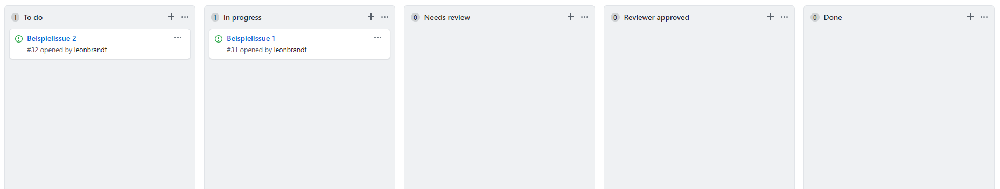

### 4.4.x. Tooling

Ein Hauptaspekt vieler Projektmanagementwerkzeuge liegt auf dem Abbilden von Arbeitspaketen in sogenannten *Tasks* oder *Issues*. Meist können mehrere Tasks zu *Milestones* zusammengefasst werden.

**Github** etwa unterstützt das Erstellen und Zuweisen dort genannter *Issues*. Sie können mit Labeln versehen werden, um z.B. Dringlichkeit abzubilden. **Trello** erweitert diese Funktionalität um die Möglichkeit ein *Due-Date* festzulegen. In **Gitlab** existiert zusätzlich eine Timetracking-Funktionalität. Auch **Jira** bietet diese Features ebenfalls und ergänzt diese um die Möglichkeit der direkten Priorisierung. All diese Tools erlauben außerdem das granulare Beschreiben von Arbeitspaketen in Checklisten und eine Diskussions-Funktion für Kommunikation betreffend einzelner Tasks. In **MS-Project** existieren die eher abgespeckten *Vorgänge*, die eine ähnliche Funktion erfüllen. Dort können jedoch Abhängigkeiten von Arbeitspaketen im Sinne eines *Projektstrukturplans* abgebildet werden. In **Jira** kann das z.B. über das Abbilden von Tasks in einer Hirachie mithilfe von Sub-Tasks erreicht werden.

  
*Timetracking in **Jira** *

  
*Timetracking in **Gitlab** über "Quick-Actions"*

Mithilfe von **MS-Project** können Arbeitspaketen Ressourcen zugewiesen werden. Übliche Ressourcen können etwa Personen, Material oder Ausrüstung sein.

  
*Ressourcenmanagement in **MS-Project** *  
Es können stündliche Kosten und wöchentliche Arbeitszeiten festgelegt werden. Mit Hilfe dieser Daten lassen sich Kostenberichte oder Schätzungen zu Machbarkeit von Tasks erzeugen.

#### Vergleich: Arbeitspakete in Projektmanagementtools

Funktionalität | Github | Gitlab | Trello | Jira | MS-Project
--- | --- | --- | --- | --- | ---
Arbeitspakete | ✔ | ✔ | ✔ | ✔ | ✔
Zusammenfassen in Milestones | ✔ | ✔ | ✔ | ✔ | ✔
Labeling | ✔ | ✔ | ✔ | ✔ | 🗙
Priorisierung | über Labels | über Labels | über Labels | ✔ | ✔
Zeitplanung (Due-Date) | 🗙 | ✔ | ✔ | ✔ | ✔
Timetracking (inkl. Schätzung) | 🗙 | ✔ | 🗙 | ✔ | ✔
Checklisten | ✔ | ✔ | ✔ | ✔ | 🗙
Diskussion | ✔ | ✔ | ✔ | ✔ | 🗙
Abhängigkeiten | 🗙 | 🗙 | 🗙 | über Sub-Tasks | ✔
Ressourcenmanagement | 🗙 | 🗙 | 🗙 | 🗙 | ✔

Alle genannten Tools ermöglichen eine Darstellung von Arbeitspaketen auf *Kanban-Boards*. Mit **Github** und **Jira** lassen sich diese zusätzlich automatisieren. **MS-Project** und **Jira** bietem als einzige Tools eine integrierte Darstellung als *Gantt-Diagramm* an.

  
*Kanban-Board in **Github** *  
Für jede Spalte kann ein Verhalten festgelegt werden. Tasks werden so automatisiert verschoben.

  
*Gantt-Diagramm in **MS-Project** *  
Das Gantt-Diagramm ist eine mächtige Ansicht, in der sich schnell viele Informationen ablesen lassen. In diesem Beispiel lässt sich zum Beispiel der Fortschritt eines einzelnen Tasks und Abhängigkeiten erkennen.

#### Vergleich: Darstellung von Arbeitspaketen in Projektmanagementtools

Funktionalität | Github | Gitlab | Trello | Jira | MS-Project
--- | --- | --- | --- | --- | ---
Kanban-Board | ✔ | ✔ | ✔ | ✔ | ✔
Automatisierung | ✔ | 🗙 | 🗙 | ✔ | 🗙
Gantt-Diagramm | 🗙 | 🗙 | 🗙 | ✔ | ✔

Die Task-Automatisierung in **Jira** ist durch sogenannte *Workflows* realisiert. Dort kann Verhalten für Tasks bei Status-Änderung definiert werden.

  
*Simples Beispiel eines Task-Workflows in **Jira** *  
In Form von Zustandsdiagrammen können bei definierten Aktionen der Status von Tasks automatisch geändert werden.

**Jira** bietet des Weiteren eine sehr mächtige *SQL*-Ähnliche Query-Language zum filtern von Tasks, die *JQL*. Mit ihr lassen sich sehr spezifische Ansichten erzeugen.

  
*Simples Beispiel einer JQL-Abfrage in **Jira** *  
In diesem Beispiel können Tasks durch simple Angabe von Filterbedingungen alle Tasks aus dem Projekt "Musterprojekt", die diese Woche erstellt wurden geordnet nach Zeitpunkt der Erstellung angezeigt werden.
