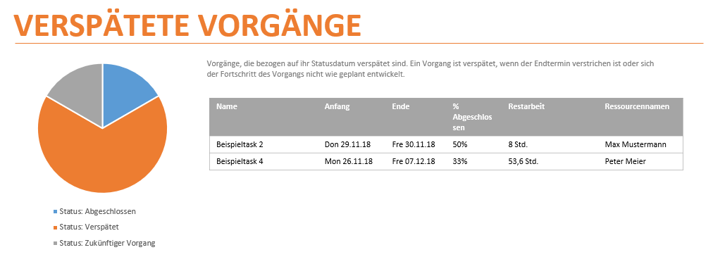

## 6.x. Tooling

Unterstützung zur Projektfortschrittskontrolle in Projektmanagementtools kann einen variierenden Umfang haben. Während **Trello** kein solches Feature bietet **Gitlab** den minimalistischen Ansatz für jeden Meilenstein den Anteil der abgeschlossenden Tasks anzuzeigen. **Github** bietet ebenfalls eine simple Darstellung auf Projektebene.

  
*Fortschritt eines Milestones in **Gitlab** *

Dedizierte Projektmanagementtools wie **Jira** und **MS-Project** legen ein großes Augenmerk auf Reporting zur Unterstützung der Fortschrittskontrolle in Projekten.

**MS-Project** bietet einen sehr mächtigen Berichts-Editor der gänzliche Freiheiten zur Erstellung von Berichten zu diversen Kennzahlen lässt. Mit Hilfe dieser Berichte lässt sich einfach der Projektfortschritt visualisieren.

  
*Vorgefertigter Bericht: Verspätete Vorgänge in **MS-Project**. Dieser Bericht berücksichtigt die Erreichbarkeit von Fristen mit Berücksichtigung der noch nötigen Arbeitszeit im Hinblick auf zugewiesene Ressourcen.*  
In diesem Beispiel gilt ein Task beispielsweise als verspätet, obwohl das Enddatum in der Zukunft liegt. Die zugewiesenen Ressourcen unterschreiten die noch nötige Arbeitszeit. Der Task ist somit nicht einzuhalten.

Noch mächtiger ist die Reporting-Funktionalität von **Jira**. Dort können zum Beispiel Berichte zu der Bearbeitungsdauer von Tasks erstellt werden. So können Trends zu Verspätungen frühzeitig erkannt werden. Verschiedene weitere  Darstellungsformen ermöglichen einen schnellen Überblick über den Projektfortschritt.

  
*Flussdiagramm in **Jira**. Sowohl Auslastung als auch Gesamtfortschritt lassen sich in dieser Darstellungsform ablesen.*  
In diesem Beispiel ist zu erkennen, das vom 6. bis zum 12. November kein Task in Arbeit war. Möglicherweise wurde also in diesem Zeitraum potential verschenkt.
