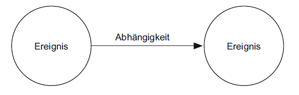
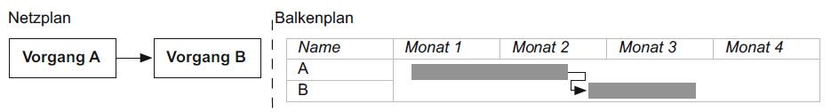
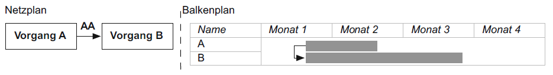

## 4.4 Projekt- und Arbeitsplanung
Eine wichtige Aufgabe des Managements eines Softwareprojekts ist die Projektplanung.
In dieser Planung werden die Vorgaben der zu erbringenden Arbeitsleistung, sowie deren Termine, festgelegt und die Ressource und zulässigen Kosten kalkuliert.
Zuerst wird ein initialer Projektplan erstellt.

### 4.4.3 Projektstrukturplan
Der Projektstrukturplan ist dafür da, um für ein großes Projekt einen besseren Überblickt zu bekommen.
Hierbei wird das Projekt in kleinere und übersichtlichere Arbeitspakete und Teilprojekte zerlegt.

#### 4.4.3.1 Erstellung
Zur Erstellung des Plans können folgende zwei Methoden benutzt werden:

###### Top-Down
Bei Top-Down wird die gesamte Problemstellung betrachet und schrittweise zerlegt und verfeinert. Dafür müssen vorher Strukturierungskriterien definiert werden, die für das Zerlegen benötigt werden.

###### Bottom-Up
Bei der Bottom-Up Methode werden zuerst im Brainstorming alle Einzelaktivitäten gesammelt und dann von unten nach oben definiert.

Um den Projektstrukturplan zu überprüfen, gibt es folgende Bedingungen, die erfüllt sein müssen:
###### Disjunktionsbedingung
Die Elemente einer Ebene müssen sich vollständig voneinander unterscheiden.

###### Vollständigkeitsbedingung
Der Inhalt der zerlegten Elemente müssen zusammen wieder das Ursprungselement ergeben. Es darf also bei der Zerlegung nichts verloren gehen.

#### 4.4.3.2 Strukturierungskriterien
Die Strukturierung von einem Projekt in Teilprojekte kann nach unterschiedlichen Strukturierungskriterien erfolgen.
Ein paar Beispiele sind die Gliederung nach Disziplinen, Architektur und Aufbau der Software und Verantwortung.

#### 4.4.3.3 Arbeitspakete
Arbeitspakete legen die durchzuführenden Arbeiten fest. Sie sind eine in sich abgeschlossene Tätigkeit mit festgelegter Dauer, Zuordnung von Personal- und Betriebsmitteln und logischen und zeitlichen Abhängigkeiten zu anderen Arbeitspaketen.
Bei Arbeitspaketen sollte die ordnungsgemäße Durchführung überwacht und festgelegt werden. Dafür können Statusinformationen und Workflows für Arbeitspakete verwendet werden.
Ein Arbeitsauftrag kann zum Beispiel die Zustände Vorgeschlagen, Aktiv, in Bearbeitung, Abgeschlossen oder Erledigt annehmen. Die Zustände dürfen nur in einer festgelegten Reihenfolge erreicht werden.
Durch die Überwachung kann die gesamte Tätigkeitsliste analysiert werden und ein groben Überblick über den Status der Arbeit liefern.

### 4.4.2 Meilensteinplanung
Mit Meilensteine werden Projektfortschritt und Qualität kontrolliert. Meilensteine werden in der Meilensteinplanung erfasst, der in den Projektstrukturplan integriert sein kann. Besonders geeignet hierfür sind Gantt-Diagramme.
!!BILD!!

Im Meilensteinplan werden Projektfortschrittstufen und Zwischenresultate des Projektverlaufs vorgegeben. Für das Erreichen von Meilensteinen ist die Qualität der zum Meilenstein fertig zu stellenden Produkte zu überprüfen und zu dokumentieren.
Die Bestimmung der Meilensteine erfolgt unterschiedlich je nach verwendetem Vorgehen im Projekt. Bei einer agilen Vorgehensweise werden Meilensteine auch an regelmäßigen Releases der Projektergebnisse geknüpft. Weitere Kriterien für Meilensteine sind kritische, nicht verrückbare Daten.

#### 4.4.2.1 Meilenstein
Ein Meilenstein definiert einen zu erreichenden Entwicklungsstand im Projekt, meist durch Beschreibeung von Projektergebnissen.
Er braucht keine Ressourcen, ist überprüfbar beschrieben (nicht erlaubt ist zum Beispiel "Programm zu 90% fertig") und von kurzer Dauer (zum Beispiel 2-4 Wochen).

#### 4.4.2.2 Eigenschaften
Meilensteine können auf unterschiedliche Arten gefunden und festgelegt werden. Folgende Eigenschaften sind zu beachten:
  * Überprüfbarkeit
    - Mit dem Erreichen des Meilensteins ist ein oder mehrere Artefakte erledigt. Die Fertigstellung ist messbar überprüfbar.
  * Kurzfristigkeit
    - Um dem Projekt genügend Zeit zum Arbeiten zu geben, gleichzeitig aber Verzögerungen frühzeitig zu erkennen, sind Abstände zwischen Meilensteinen kurz zu wählen.
  * Gleichvereteilung
    - Meilensteine sollten gleichmäßig zu verteilen und eine ausgewogene Fortschrittskontolle zu ermöglichen.

#### 4.4.2.3 Zeitliche Verteilung
Der zeitliche Abstand von Meilensteinen sollte relativ kurz sein (etwa 3-4 Wochen), um den Projektfortschritt gut kontrollieren zu können. Beachtet werden muss, dass die Zeit zwischen den Meilensteinen weder zu gering noch zu groß ist. Bei zu geringem Abstand bleibt zu wenig Zeit für die inhaltliche Arbeit, da kontinuierlich Meilensteine vorzubereiten sind. Ist der Abstand zu groß, können Fehlentwicklungen im Projekt zu spät erkannt werden.

#### 4.4.2.4 Feststellen der Zielerreichung
Meilensteine sind Zwischenziele im Projekt. Diese müssen regelmäßig kontrolliert werden. Wenn ein Meilenstein erreicht wird, werden die Artefakte des Meilensteins überprüft.

#### 4.4.2.5 Blockierende Meilensteine
Blockierende Meilensteine sind von Entscheidungen abhängig, die den weiteren Projektablauf beeinflussen können. Sie werden in der Projektplanung früh festgelegt.
Die Entscheidungsfindung wird in der Regel ausßerhalb des Projektteams erfolgen. Typische blockierende Meilensteine sind zum Beispiel: Projekt genehmigt, Andorderungen festgelegt, Projekt beauftragt, Abnahme erfolgt.

### 4.4.2 Netzplantechnik
Aufgrund der Abhängigkeiten und der Zusammenhänge zwischen Aufgaben und Ressourcen können die Zeitpunkte für die Durchführung von Tätigkeiten mithilfe der Netzplantechnik berechnet und grafisch dargestellt werden. Mit dem Netplan kann man bestimmen wie lange das Projekt mindestens dauern wird, welche Arbeitspakete das Projekt verzögern können, ob das Projekt im Zeitplan ist und ob es früher oder später fertig werden wird.
Durch ihn hat man früh ein Gesamtbild des Projektes und kann frühzeitig die benötigte Bearbeitungsdauer für das Projekt abschätzen.

#### 4.4.2.1 Darstellung von Netzplänen
##### MPM-Netzplan
Der MPM-Netzplan wird auch als Standard-Netzplan bezeichnet. Die Knoten des Plans stellen Vorgänge dar und die Pfeile die logischen Abhängigkeiten.

##### Vorgangspfeil-Netzplan
In einem CPM-Netzplan stellen die Pfeile die Vorgänge dar. Die Knoten stellen die Abhängigkeiten im Sinne von Anfangs- und Endereignissen eines Vorgangs dar.

##### Ereignisknoten-Netzplantechnik
Der PERT-Plan ist ein ereignisorientierter Netzplan. Die Knoten stellen die Ereignisse dar und die Pfeile deren Abhängigkeiten. Die Dauer der Tätigkeiten wird nicht fix angegeben, sondern durch erwartete frühste und späteste Termine bestimmt.

#### 4.4.2.2 Kritische Pfade und Optimierung
Wichtig bei der Planung ist ein Optimierungsziel. Zum einen will man den benötigten Aufwand klein halten und zum anderen die gesamte Entwicklungsdauer mit maximalem Aufwand minimieren.
Ein Kritischer Pfad sind die Vorgänge, die bei zeitlicher Änderung, den Endtermin des gesamten Netzplans verschieben. Es gibt immer mindestens einen kritischen Pfad im Netzplan.

##### Probleme in der Anwendung
Die Netzplantechnik ist eine allgemeine Methode zur Projektplanung. Folgende Probleme tauchen bei der Anwendung in der Softwareentwicklung auf:

###### Randbedingungen
Der Ausgleich der Randbedingungen, zum Beispiel durch Einfluss anderer Projekte und Fehlzeiten, ist schwer in einem Netzplan zu berücksichtigen.

###### Abhängigkeiten
Es gibt nicht immer so feste Abhängigkeiten zwischen Vorgängen. Netzpläne zeigen somit eine Präzision an, die sie möglicherweise garnicht haben.

###### Detailierungsgrad
Da man Teilaufgaben häufig vorziehen kann, ist im Netzplan eine Untergliederung des Projekts erforderlich. Dadurch kann ein Netzplan nicht mehr sinvoll anwendbar sein.

Die Netzplantechnik eignet sich gut für die Grobplanung des Projekts. Aufgrund der schnell erreichten Komplexität, sollte man Werkzeuge nutzen, die die entsprechenden Techniken anbieten.

### 4.4.3 Balkenplantechnik
Der Projektstrukturplan zeigt die Abhängigkeiten der Arbeitspakete. Der Nachteil an Netzplänen ist, dass die Möglichkeiten, dass mehrere Arbeitspakete parallel laufen können, nicht dargestellt werden können.

#### 4.4.3.1 Darstellung als Gantt-Diagramm
Mithilfe eines Gantt-Diagramm ist es Möglich Projektpläne als Balkendiagramme darzustellen. Hierbei werden Zeiten und Dauer von Vorgängen auf einer Zeitachse angeordnet und in Beziehung gesetzt.
Die Vorgänge werden in die erste Spalte der Tabelle eingetragen. Die Zeitachse wird in der ersten Zeile dargestellt. Mit waagerechten Balken werden dann die jeweiligen Vorgänge visualisiert. Je länger der Balken, desto länger der Vorgang.

##### Vernetzte und unvernetzte Gantt-Diagramme
In einem unvernetzten Plan sind alle Vorgänge eingetragen, jedoch gibt es keine Abhängigkeiten zwischen den Vorgängen. Die Abhängigkeiten werden erst im späteren Verlauf definiert und eingetragen. Als Ergebnis entsteht ein vernetzter Gantt-Plan.

##### Personen- vs. aufgabenbezogene Gantt-Diagramme
Ein aufgabenbezogenes Diagramm ist, wenn die Vorgänge des Projekts in den Zeilen enthalten und deren Dauer der Zeitachse eingetragen sind. Bei jedem Vorgang sind auch die Bearbeiter angegeben. Durch diese Sicht kann man das Gesamtprojekt im Auge behalten. Wenn man aber wissen möchte, welcher Mitarbeiter welche Aufgaben betreut ist ein personenbezogenes Gantt-Diagramm vom Vorteil.

#### 4.4.3.2 Beziehungen und Abhängigkeiten
Die Pfeile der Abhängigkeiten in der Netzplantechnik wie auch bei Gantt-Diagrammen haben eine besondere Bedeutung. In der Balkenplantechnik und auch in der Netzplantechnik werden die Beziehungen jedoch über einfache logische Abfolgen weiter verfeinert.

##### Normalfolge
Wenn Vorgang A abgeschlossen sein muss bevor Vorgang B begonnen werden kann, spricht man von einer Normalfolge.

##### Anfangsfolge
Wenn der Beginn eines Vorgangs A die Bedinung dafür ist, dass ein Vorgang B begonnen werden kann, spricht man von einer Anfangsfolge.

##### Endfolge
Wenn der Abschluss eines Vorgangs A die Bedingung dafür ist, dass ein Vorgang B beendet werden kann, spricht man von einer Endfolge.

##### Sprungfolge
Wenn der Abschluss eines Vorgangs B die Voraussetzung dafür ist, dass ein Vorgang A begonnen werden kann, spricht man von einer Sprungfolge.

### 4.4.4 Philosophien zur Projektplanung
Die Projektplanung kann sich an unterschiedliche Philosophien orientieren. Es kann eine meilensteinbasierte Planung sein oder eine Time Boxing Planung.

#### 4.4.4.1 Meilenstein-orientierte Planung
Meilensteine sind in der Meilenstein-orientierten Planung das Grundgerüst. Sie lassen sicht recht einfach identifizieren. Auch Vorgehensmodelle enthalten in der Regel Meilensteine. Sie sind dabei keine zeitlich fixierten punkte, sondern variable Elemente des Projektplans.

#### 4.4.4.2 Fast Tracking
Eine Technik, die meilensteinorientiertes, paralleles Arbeiten erlaubt ist das Fast Tracking. Das Fast Tracking eignet sich besonders für produktzentriete Vorgehensmodelle wie das V-Modell. Es wird festgelegt, wann ein Artefakt spätestens fertiggestellt und qualitätsgesichert werden muss. Weiterhin ist festgelegt, welche Abhängigkeiten zwischen den einzelnen Artefakten besteht. Somit kann ermittelt werden, welche Artefakte zuerst und welche auf dieser Grundlage erstellt werden können.

#### 4.4.4.3 Time Boxing
Als Alternative zur meilensteinorientierten Projektplanung gibt es das Time Boxing. Hierbei werden Zeitpunkte für die Überprüfung des Projektstandes festgelegt. Typische Überprüfungszeitpunkte ist ein Abstand von vier bis sechs Wochen. Im Extremfall werden die geplanten Projektergebnisse in der vorliegenden Form ohne Umplanung in den nächsten Projektabschnitt übernommen. Das heißt, dass beim Time Boxing keine Änderungen an der Zeitplanung gemacht werden. Stattdessen werden Umfang oder Qualität der Artefakte angepasst.
